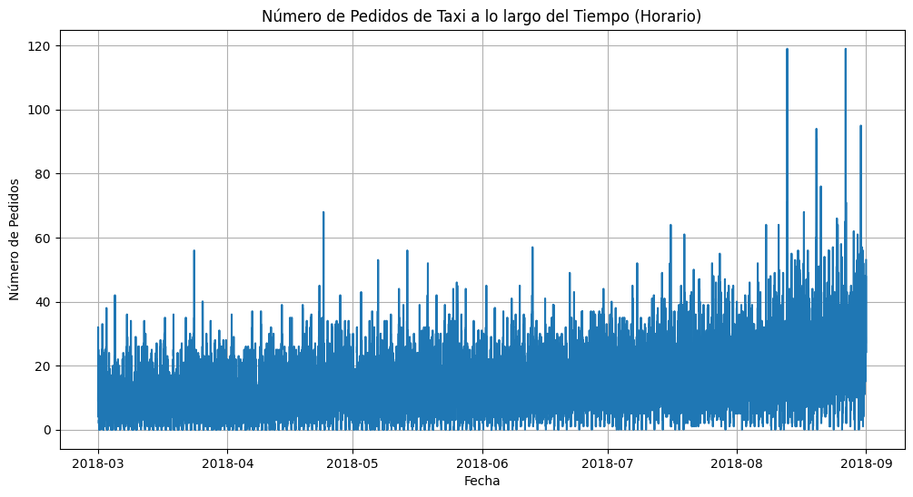

# 🚕 Proyecto 15: Sweet Lift Taxi

 
Este proyecto analiza datos de viajes en taxi para optimizar rutas, precios y mejorar la experiencia del usuario.

---

## 🚀 Objetivo
Implementar modelos de análisis de datos y machine learning para aumentar la eficiencia y rentabilidad del servicio de taxi.

---

## 🧩 Estructura del Proyecto
- `Proyecto_15.ipynb`: Análisis exploratorio, modelado y resultados
- Archivos CSV: Datos de viajes y tarifas
- Reportes y visualizaciones

---

## 🛠️ Tecnologías y Herramientas
    

---

## 📈 Resultados Destacados
- Identificación de patrones de viaje y optimización de rutas
- Modelos predictivos para estimar tarifas y demanda
- Visualizaciones interactivas y reportes claros

---

## 🖼️ Visualización

### Ejemplo de resultado

---

## 🏁 Conclusión del Proyecto

Este proyecto demuestra cómo el análisis de datos y el aprendizaje automático pueden transformar el servicio de taxi, permitiendo optimizar rutas, precios y mejorar la experiencia del usuario. Los modelos implementados ofrecen resultados precisos y útiles para la toma de decisiones en la industria del transporte.
